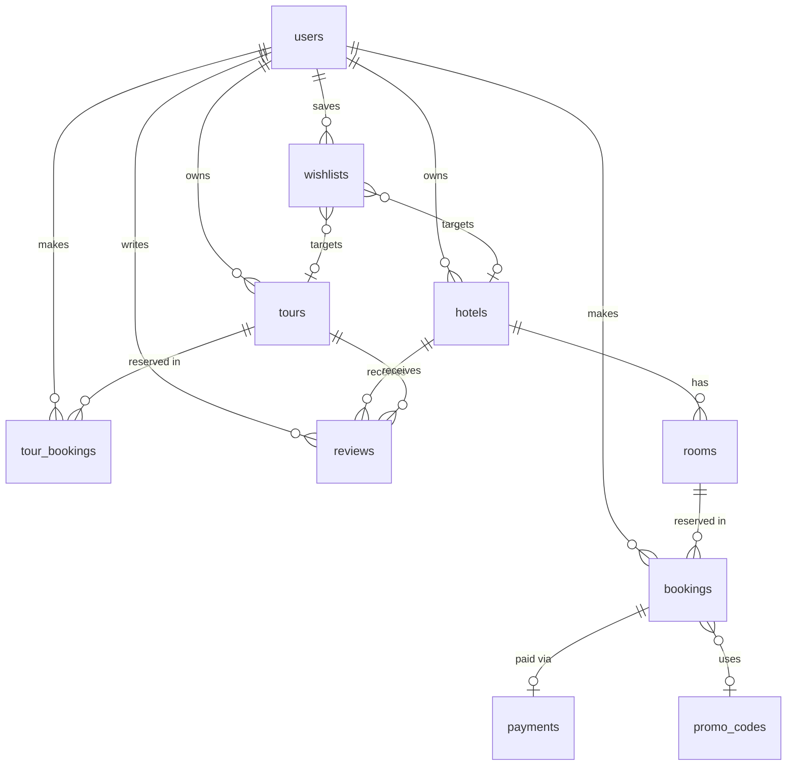

# 📦 Database Documentation

> **The Integrated Accommodation and Tour Booking Website**
>
> ORM: SQLAlchemy 2.x (Mapped / mapped_column) · RDBMS: PostgreSQL · Migrations: Alembic

---

## Table of Contents

- [Overview](#overview)
- [Base Model (Inherited Columns)](#base-model-inherited-columns)
- [Enumerations](#enumerations)
- [Tables](#tables)
  - [users](#1-users)
  - [hotels](#2-hotels)
  - [rooms](#3-rooms)
  - [bookings](#4-bookings)
  - [tours](#5-tours)
  - [tour\_bookings](#6-tour_bookings)
  - [payments](#7-payments)
  - [reviews](#8-reviews)
  - [wishlists](#9-wishlists)
  - [promo\_codes](#10-promo_codes)
- [Relationships Summary](#relationships-summary)
- [Entity-Relationship Diagram](#entity-relationship-diagram)
- [Check Constraints](#check-constraints)
- [Indexes](#indexes)
- [Cascade / Delete Rules](#cascade--delete-rules)

---

## Overview

The database consists of **10 tables** supporting two core business domains:

| Domain | Tables |
|---|---|
| **Accommodation** | `users`, `hotels`, `rooms`, `bookings`, `payments`, `promo_codes` |
| **Tours** | `users`, `tours`, `tour_bookings` |
| **Shared / Cross-cutting** | `reviews`, `wishlists` |

All tables inherit three common columns from the abstract `Base` model (see below).

---

## Base Model (Inherited Columns)

> **Source:** [base.py](file:///Users/nguyenlong/Documents/Booking_Web_Project/backend/app/db/base.py)

Every table automatically includes the following columns:

| Column | Type | Constraints | Description |
|---|---|---|---|
| `id` | `UUID` | **PK**, default `uuid4`, server_default `gen_random_uuid()` | Universally unique identifier |
| `created_at` | `TIMESTAMP WITH TIME ZONE` | NOT NULL, server_default `now()` | Record creation timestamp |
| `updated_at` | `TIMESTAMP WITH TIME ZONE` | NOT NULL, server_default `now()`, onupdate `now()` | Last update timestamp |

---

## Enumerations

### `UserRole`

> **Source:** [user.py](file:///Users/nguyenlong/Documents/Booking_Web_Project/backend/app/models/user.py)

| Value | Description |
|---|---|
| `user` | Regular platform user |
| `admin` | Hotel / tour administrator |
| `superadmin` | Platform-wide super administrator |

### `BookingStatus`

> **Source:** [booking.py](file:///Users/nguyenlong/Documents/Booking_Web_Project/backend/app/models/booking.py)

| Value | Description |
|---|---|
| `pending` | Booking has been created but not yet confirmed |
| `confirmed` | Booking is confirmed |
| `cancelled` | Booking was cancelled |
| `completed` | Stay / booking has been completed |

### `TourBookingStatus`

> **Source:** [tour_booking.py](file:///Users/nguyenlong/Documents/Booking_Web_Project/backend/app/models/tour_booking.py)

| Value | Description |
|---|---|
| `pending` | Tour booking created, awaiting confirmation |
| `confirmed` | Tour booking confirmed |
| `cancelled` | Tour booking cancelled |
| `completed` | Tour has been completed |

### `PaymentStatus`

> **Source:** [payment.py](file:///Users/nguyenlong/Documents/Booking_Web_Project/backend/app/models/payment.py)

| Value | Description |
|---|---|
| `pending` | Payment initiated but not yet processed |
| `succeeded` | Payment successfully processed |
| `failed` | Payment processing failed |
| `refunded` | Payment has been refunded |

---

## Tables

### 1. `users`

> **Source:** [user.py](file:///Users/nguyenlong/Documents/Booking_Web_Project/backend/app/models/user.py)
>
> Stores user accounts with role-based access control.

| Column | Type | Constraints | Default | Description |
|---|---|---|---|---|
| `id` | `UUID` | **PK** | `uuid4` | *Inherited from Base* |
| `email` | `VARCHAR(255)` | **UNIQUE**, NOT NULL, **INDEXED** | — | User email address (login identifier) |
| `hashed_password` | `VARCHAR(255)` | NOT NULL | — | Bcrypt-hashed password |
| `full_name` | `VARCHAR(255)` | NOT NULL | — | User's display name |
| `phone` | `VARCHAR(50)` | NULLABLE | `NULL` | Phone number |
| `avatar_url` | `TEXT` | NULLABLE | `NULL` | URL to profile avatar (Cloudinary) |
| `role` | `VARCHAR(20)` | — | `'user'` | One of `UserRole` enum values |
| `is_active` | `BOOLEAN` | — | `true` | Whether the account is active |
| `loyalty_points` | `INTEGER` | — | `0` | Accumulated loyalty points |
| `created_at` | `TIMESTAMPTZ` | NOT NULL | `now()` | *Inherited from Base* |
| `updated_at` | `TIMESTAMPTZ` | NOT NULL | `now()` | *Inherited from Base* |

**Relationships:**

| Relationship | Target | Type | Loading | Notes |
|---|---|---|---|---|
| `bookings` | `Booking` | One-to-Many | `selectin` | Hotel room bookings |
| `tour_bookings` | `TourBooking` | One-to-Many | `selectin` | Tour bookings |
| `reviews` | `Review` | One-to-Many | `selectin` | User reviews |
| `wishlists` | `Wishlist` | One-to-Many | `selectin` | Saved favorites |
| `hotels` | `Hotel` | One-to-Many | `noload` | Hotels owned (admin) |
| `tours` | `Tour` | One-to-Many | `noload` | Tours owned (admin) |

---

### 2. `hotels`

> **Source:** [hotel.py](file:///Users/nguyenlong/Documents/Booking_Web_Project/backend/app/models/hotel.py)
>
> Accommodation property listings.

| Column | Type | Constraints | Default | Description |
|---|---|---|---|---|
| `id` | `UUID` | **PK** | `uuid4` | *Inherited from Base* |
| `name` | `VARCHAR(255)` | NOT NULL | — | Hotel/property name |
| `slug` | `VARCHAR(255)` | **UNIQUE**, NOT NULL, **INDEXED** | — | URL-friendly identifier |
| `description` | `TEXT` | NULLABLE | `NULL` | Full description |
| `address` | `VARCHAR(500)` | NULLABLE | `NULL` | Street address |
| `city` | `VARCHAR(100)` | NOT NULL, **INDEXED** | — | City location |
| `country` | `VARCHAR(100)` | NOT NULL, **INDEXED** | — | Country location |
| `latitude` | `FLOAT` | NULLABLE | `NULL` | GPS latitude |
| `longitude` | `FLOAT` | NULLABLE | `NULL` | GPS longitude |
| `star_rating` | `INTEGER` | — | `3` | Star classification (1–5) |
| `property_type` | `VARCHAR(50)` | NULLABLE | `NULL` | e.g. Hotel, Resort, Villa |
| `amenities` | `JSONB` | NULLABLE | `[]` | List of amenity strings |
| `images` | `JSONB` | NULLABLE | `[]` | List of image URLs |
| `base_price` | `NUMERIC(10,2)` | NOT NULL | — | Starting price for display |
| `currency` | `VARCHAR(10)` | — | `'USD'` | Price currency code |
| `avg_rating` | `FLOAT` | — | `0` | Calculated average review rating |
| `total_reviews` | `INTEGER` | — | `0` | Cached review count |
| `owner_id` | `UUID` | **FK → users.id**, NULLABLE, **INDEXED** | `NULL` | Admin who manages this hotel |
| `created_at` | `TIMESTAMPTZ` | NOT NULL | `now()` | *Inherited from Base* |
| `updated_at` | `TIMESTAMPTZ` | NOT NULL | `now()` | *Inherited from Base* |

**Foreign Keys:**

| Column | References | On Delete |
|---|---|---|
| `owner_id` | `users.id` | `SET NULL` |

**Relationships:**

| Relationship | Target | Type | Loading | Notes |
|---|---|---|---|---|
| `owner` | `User` | Many-to-One | `selectin` | The admin/owner |
| `rooms` | `Room` | One-to-Many | `selectin` | Cascade `all, delete-orphan` |
| `reviews` | `Review` | One-to-Many | `selectin` | Hotel reviews |

---

### 3. `rooms`

> **Source:** [room.py](file:///Users/nguyenlong/Documents/Booking_Web_Project/backend/app/models/room.py)
>
> Room types within a hotel property.

| Column | Type | Constraints | Default | Description |
|---|---|---|---|---|
| `id` | `UUID` | **PK** | `uuid4` | *Inherited from Base* |
| `hotel_id` | `UUID` | **FK → hotels.id**, NOT NULL, **INDEXED** | — | Parent hotel |
| `name` | `VARCHAR(255)` | NOT NULL | — | Room name (e.g. "Deluxe Suite") |
| `description` | `TEXT` | NULLABLE | `NULL` | Room description |
| `room_type` | `VARCHAR(50)` | NOT NULL | — | Category (e.g. single, double, suite) |
| `price_per_night` | `NUMERIC(10,2)` | NOT NULL | — | Nightly rate |
| `total_quantity` | `INTEGER` | — | `1` | Number of rooms of this type |
| `max_guests` | `INTEGER` | — | `2` | Maximum occupancy |
| `amenities` | `JSONB` | NULLABLE | `[]` | Room-specific amenities |
| `images` | `JSONB` | NULLABLE | `[]` | Room image URLs |
| `created_at` | `TIMESTAMPTZ` | NOT NULL | `now()` | *Inherited from Base* |
| `updated_at` | `TIMESTAMPTZ` | NOT NULL | `now()` | *Inherited from Base* |

**Foreign Keys:**

| Column | References | On Delete |
|---|---|---|
| `hotel_id` | `hotels.id` | `CASCADE` |

**Relationships:**

| Relationship | Target | Type | Loading | Notes |
|---|---|---|---|---|
| `hotel` | `Hotel` | Many-to-One | *default* | Parent hotel |
| `bookings` | `Booking` | One-to-Many | `selectin` | Reservations for this room |

---

### 4. `bookings`

> **Source:** [booking.py](file:///Users/nguyenlong/Documents/Booking_Web_Project/backend/app/models/booking.py)
>
> Hotel room reservations linking a user to a room for specific dates.

| Column | Type | Constraints | Default | Description |
|---|---|---|---|---|
| `id` | `UUID` | **PK** | `uuid4` | *Inherited from Base* |
| `user_id` | `UUID` | **FK → users.id**, NOT NULL, **INDEXED** | — | Guest making the booking |
| `room_id` | `UUID` | **FK → rooms.id**, NOT NULL, **INDEXED** | — | Room being booked |
| `check_in` | `DATE` | NOT NULL, **INDEXED** | — | Check-in date |
| `check_out` | `DATE` | NOT NULL, **INDEXED** | — | Check-out date |
| `guests_count` | `INTEGER` | — | `1` | Number of guests |
| `total_price` | `NUMERIC(10,2)` | NOT NULL | — | Total cost after promo code |
| `status` | `VARCHAR(20)` | — | `'pending'` | One of `BookingStatus` enum values |
| `special_requests` | `TEXT` | NULLABLE | `NULL` | Guest special requests |
| `promo_code_id` | `UUID` | **FK → promo_codes.id**, NULLABLE | `NULL` | Applied discount code |
| `created_at` | `TIMESTAMPTZ` | NOT NULL | `now()` | *Inherited from Base* |
| `updated_at` | `TIMESTAMPTZ` | NOT NULL | `now()` | *Inherited from Base* |

**Foreign Keys:**

| Column | References | On Delete |
|---|---|---|
| `user_id` | `users.id` | `CASCADE` |
| `room_id` | `rooms.id` | `CASCADE` |
| `promo_code_id` | `promo_codes.id` | `SET NULL` |

**Relationships:**

| Relationship | Target | Type | Loading | Notes |
|---|---|---|---|---|
| `user` | `User` | Many-to-One | *default* | The guest |
| `room` | `Room` | Many-to-One | *default* | The booked room |
| `payment` | `Payment` | One-to-One | `selectin` | Associated Stripe payment |

---

### 5. `tours`

> **Source:** [tour.py](file:///Users/nguyenlong/Documents/Booking_Web_Project/backend/app/models/tour.py)
>
> Tour and experience listings.

| Column | Type | Constraints | Default | Description |
|---|---|---|---|---|
| `id` | `UUID` | **PK** | `uuid4` | *Inherited from Base* |
| `name` | `VARCHAR(255)` | NOT NULL | — | Tour name |
| `slug` | `VARCHAR(255)` | **UNIQUE**, NOT NULL, **INDEXED** | — | URL-friendly identifier |
| `description` | `TEXT` | NULLABLE | `NULL` | Full tour description |
| `city` | `VARCHAR(100)` | NOT NULL, **INDEXED** | — | Tour location city |
| `country` | `VARCHAR(100)` | NOT NULL | — | Tour location country |
| `category` | `VARCHAR(50)` | NULLABLE | `NULL` | e.g. Adventure, Cultural, Food |
| `duration_days` | `INTEGER` | — | `1` | Length of tour in days |
| `max_participants` | `INTEGER` | — | `20` | Maximum group size |
| `price_per_person` | `NUMERIC(10,2)` | NOT NULL | — | Per-person price |
| `highlights` | `JSONB` | NULLABLE | `[]` | Key tour highlights |
| `itinerary` | `JSONB` | NULLABLE | `[]` | Day-by-day schedule |
| `includes` | `JSONB` | NULLABLE | `[]` | What's included |
| `excludes` | `JSONB` | NULLABLE | `[]` | What's not included |
| `images` | `JSONB` | NULLABLE | `[]` | Tour image URLs |
| `avg_rating` | `FLOAT` | — | `0` | Calculated average rating |
| `total_reviews` | `INTEGER` | — | `0` | Cached review count |
| `owner_id` | `UUID` | **FK → users.id**, NULLABLE, **INDEXED** | `NULL` | Admin who manages this tour |
| `created_at` | `TIMESTAMPTZ` | NOT NULL | `now()` | *Inherited from Base* |
| `updated_at` | `TIMESTAMPTZ` | NOT NULL | `now()` | *Inherited from Base* |

**Foreign Keys:**

| Column | References | On Delete |
|---|---|---|
| `owner_id` | `users.id` | `SET NULL` |

**Relationships:**

| Relationship | Target | Type | Loading | Notes |
|---|---|---|---|---|
| `owner` | `User` | Many-to-One | `selectin` | The admin/owner |
| `tour_bookings` | `TourBooking` | One-to-Many | `selectin` | Reservations |
| `reviews` | `Review` | One-to-Many | `selectin` | Tour reviews |

---

### 6. `tour_bookings`

> **Source:** [tour_booking.py](file:///Users/nguyenlong/Documents/Booking_Web_Project/backend/app/models/tour_booking.py)
>
> Tour reservations linking a user to a tour for a specific date.

| Column | Type | Constraints | Default | Description |
|---|---|---|---|---|
| `id` | `UUID` | **PK** | `uuid4` | *Inherited from Base* |
| `user_id` | `UUID` | **FK → users.id**, NOT NULL, **INDEXED** | — | Guest making the booking |
| `tour_id` | `UUID` | **FK → tours.id**, NOT NULL, **INDEXED** | — | Tour being booked |
| `tour_date` | `DATE` | NOT NULL | — | Date of the tour |
| `participants_count` | `INTEGER` | — | `1` | Number of participants |
| `total_price` | `NUMERIC(10,2)` | NOT NULL | — | Total cost |
| `status` | `VARCHAR(20)` | — | `'pending'` | One of `TourBookingStatus` enum values |
| `special_requests` | `TEXT` | NULLABLE | `NULL` | Special requests |
| `created_at` | `TIMESTAMPTZ` | NOT NULL | `now()` | *Inherited from Base* |
| `updated_at` | `TIMESTAMPTZ` | NOT NULL | `now()` | *Inherited from Base* |

**Foreign Keys:**

| Column | References | On Delete |
|---|---|---|
| `user_id` | `users.id` | `CASCADE` |
| `tour_id` | `tours.id` | `CASCADE` |

**Relationships:**

| Relationship | Target | Type | Loading | Notes |
|---|---|---|---|---|
| `user` | `User` | Many-to-One | *default* | The guest |
| `tour` | `Tour` | Many-to-One | *default* | The booked tour |

---

### 7. `payments`

> **Source:** [payment.py](file:///Users/nguyenlong/Documents/Booking_Web_Project/backend/app/models/payment.py)
>
> Stripe payment records associated with hotel bookings.

| Column | Type | Constraints | Default | Description |
|---|---|---|---|---|
| `id` | `UUID` | **PK** | `uuid4` | *Inherited from Base* |
| `booking_id` | `UUID` | **FK → bookings.id**, NULLABLE | `NULL` | Associated hotel booking |
| `stripe_payment_intent_id` | `VARCHAR(255)` | **UNIQUE**, NULLABLE | `NULL` | Stripe PaymentIntent ID |
| `amount` | `NUMERIC(10,2)` | NOT NULL | — | Payment amount |
| `currency` | `VARCHAR(10)` | — | `'usd'` | Payment currency |
| `status` | `VARCHAR(20)` | — | `'pending'` | One of `PaymentStatus` enum values |
| `created_at` | `TIMESTAMPTZ` | NOT NULL | `now()` | *Inherited from Base* |
| `updated_at` | `TIMESTAMPTZ` | NOT NULL | `now()` | *Inherited from Base* |

**Foreign Keys:**

| Column | References | On Delete |
|---|---|---|
| `booking_id` | `bookings.id` | `SET NULL` |

**Relationships:**

| Relationship | Target | Type | Loading | Notes |
|---|---|---|---|---|
| `booking` | `Booking` | One-to-One | *default* | The parent booking |

---

### 8. `reviews`

> **Source:** [review.py](file:///Users/nguyenlong/Documents/Booking_Web_Project/backend/app/models/review.py)
>
> User ratings and comments. Uses a **polymorphic pattern** — each review targets either a hotel **OR** a tour (enforced by a check constraint).

| Column | Type | Constraints | Default | Description |
|---|---|---|---|---|
| `id` | `UUID` | **PK** | `uuid4` | *Inherited from Base* |
| `user_id` | `UUID` | **FK → users.id**, NOT NULL | — | Review author |
| `hotel_id` | `UUID` | **FK → hotels.id**, NULLABLE | `NULL` | Target hotel (mutually exclusive with `tour_id`) |
| `tour_id` | `UUID` | **FK → tours.id**, NULLABLE | `NULL` | Target tour (mutually exclusive with `hotel_id`) |
| `rating` | `INTEGER` | NOT NULL | — | Rating score |
| `comment` | `TEXT` | NULLABLE | `NULL` | Review text |
| `created_at` | `TIMESTAMPTZ` | NOT NULL | `now()` | *Inherited from Base* |
| `updated_at` | `TIMESTAMPTZ` | NOT NULL | `now()` | *Inherited from Base* |

**Foreign Keys:**

| Column | References | On Delete |
|---|---|---|
| `user_id` | `users.id` | `CASCADE` |
| `hotel_id` | `hotels.id` | `CASCADE` |
| `tour_id` | `tours.id` | `CASCADE` |

**Check Constraints:**

| Name | Rule |
|---|---|
| `review_single_target` | `(hotel_id IS NOT NULL AND tour_id IS NULL) OR (hotel_id IS NULL AND tour_id IS NOT NULL)` |

**Relationships:**

| Relationship | Target | Type | Loading | Notes |
|---|---|---|---|---|
| `user` | `User` | Many-to-One | *default* | The reviewer |
| `hotel` | `Hotel` | Many-to-One | *default* | Target hotel |
| `tour` | `Tour` | Many-to-One | *default* | Target tour |

---

### 9. `wishlists`

> **Source:** [wishlist.py](file:///Users/nguyenlong/Documents/Booking_Web_Project/backend/app/models/wishlist.py)
>
> User saved favorites. Uses the same **polymorphic pattern** as `reviews` — each entry targets either a hotel **OR** a tour.

| Column | Type | Constraints | Default | Description |
|---|---|---|---|---|
| `id` | `UUID` | **PK** | `uuid4` | *Inherited from Base* |
| `user_id` | `UUID` | **FK → users.id**, NOT NULL | — | User who saved the item |
| `hotel_id` | `UUID` | **FK → hotels.id**, NULLABLE | `NULL` | Saved hotel (mutually exclusive with `tour_id`) |
| `tour_id` | `UUID` | **FK → tours.id**, NULLABLE | `NULL` | Saved tour (mutually exclusive with `hotel_id`) |
| `created_at` | `TIMESTAMPTZ` | NOT NULL | `now()` | *Inherited from Base* |
| `updated_at` | `TIMESTAMPTZ` | NOT NULL | `now()` | *Inherited from Base* |

**Foreign Keys:**

| Column | References | On Delete |
|---|---|---|
| `user_id` | `users.id` | `CASCADE` |
| `hotel_id` | `hotels.id` | `CASCADE` |
| `tour_id` | `tours.id` | `CASCADE` |

**Check Constraints:**

| Name | Rule |
|---|---|
| `wishlist_single_target` | `(hotel_id IS NOT NULL AND tour_id IS NULL) OR (hotel_id IS NULL AND tour_id IS NOT NULL)` |

**Relationships:**

| Relationship | Target | Type | Loading | Notes |
|---|---|---|---|---|
| `user` | `User` | Many-to-One | *default* | The user |
| `hotel` | `Hotel` | Many-to-One | `selectin` | Saved hotel |
| `tour` | `Tour` | Many-to-One | `selectin` | Saved tour |

---

### 10. `promo_codes`

> **Source:** [promo_code.py](file:///Users/nguyenlong/Documents/Booking_Web_Project/backend/app/models/promo_code.py)
>
> Discount codes that can be applied to hotel bookings.

| Column | Type | Constraints | Default | Description |
|---|---|---|---|---|
| `id` | `UUID` | **PK** | `uuid4` | *Inherited from Base* |
| `code` | `VARCHAR(50)` | **UNIQUE**, NOT NULL, **INDEXED** | — | Human-readable promo code |
| `discount_percent` | `NUMERIC(5,2)` | NOT NULL | — | Percentage discount (e.g. 15.00 = 15%) |
| `max_uses` | `INTEGER` | — | `100` | Maximum redemptions allowed |
| `current_uses` | `INTEGER` | — | `0` | Times redeemed so far |
| `min_booking_amount` | `NUMERIC(10,2)` | — | `0` | Minimum booking total to qualify |
| `is_active` | `BOOLEAN` | — | `true` | Whether code is currently active |
| `expires_at` | `TIMESTAMPTZ` | NULLABLE | `NULL` | Expiration date (NULL = no expiry) |
| `created_at` | `TIMESTAMPTZ` | NOT NULL | `now()` | *Inherited from Base* |
| `updated_at` | `TIMESTAMPTZ` | NOT NULL | `now()` | *Inherited from Base* |

**Relationships:** None (referenced via FK from `bookings.promo_code_id`)

---

## Relationships Summary

### Relationship Details (15 total)

| # | From | To | Type | FK Column | On Delete | Description |
|---|---|---|---|---|---|---|
| 1 | `hotels` | `users` | Many-to-One | `owner_id` | `SET NULL` | Hotel owner |
| 2 | `tours` | `users` | Many-to-One | `owner_id` | `SET NULL` | Tour owner |
| 3 | `rooms` | `hotels` | Many-to-One | `hotel_id` | `CASCADE` | Rooms belong to hotel |
| 4 | `bookings` | `users` | Many-to-One | `user_id` | `CASCADE` | Guest who booked |
| 5 | `bookings` | `rooms` | Many-to-One | `room_id` | `CASCADE` | Room being booked |
| 6 | `bookings` | `promo_codes` | Many-to-One | `promo_code_id` | `SET NULL` | Applied discount |
| 7 | `tour_bookings` | `users` | Many-to-One | `user_id` | `CASCADE` | Guest who booked |
| 8 | `tour_bookings` | `tours` | Many-to-One | `tour_id` | `CASCADE` | Tour being booked |
| 9 | `payments` | `bookings` | One-to-One | `booking_id` | `SET NULL` | Payment for booking |
| 10 | `reviews` | `users` | Many-to-One | `user_id` | `CASCADE` | Review author |
| 11 | `reviews` | `hotels` | Many-to-One | `hotel_id` | `CASCADE` | Reviewed hotel |
| 12 | `reviews` | `tours` | Many-to-One | `tour_id` | `CASCADE` | Reviewed tour |
| 13 | `wishlists` | `users` | Many-to-One | `user_id` | `CASCADE` | Wishlist owner |
| 14 | `wishlists` | `hotels` | Many-to-One | `hotel_id` | `CASCADE` | Saved hotel |
| 15 | `wishlists` | `tours` | Many-to-One | `tour_id` | `CASCADE` | Saved tour |

---

## Check Constraints

| Table | Constraint Name | Rule | Purpose |
|---|---|---|---|
| `reviews` | `review_single_target` | Exactly one of `hotel_id` or `tour_id` must be non-NULL | Enforces polymorphic single-target |
| `wishlists` | `wishlist_single_target` | Exactly one of `hotel_id` or `tour_id` must be non-NULL | Enforces polymorphic single-target |

---

## Indexes

| Table | Column(s) | Type | Notes |
|---|---|---|---|
| `users` | `email` | Unique + Index | Login lookup |
| `hotels` | `slug` | Unique + Index | URL routing |
| `hotels` | `city` | Index | Location search |
| `hotels` | `country` | Index | Location search |
| `hotels` | `owner_id` | Index | Owner lookup |
| `rooms` | `hotel_id` | Index | Hotel → rooms lookup |
| `bookings` | `user_id` | Index | User booking history |
| `bookings` | `room_id` | Index | Room availability check |
| `bookings` | `check_in` | Index | Date range queries |
| `bookings` | `check_out` | Index | Date range queries |
| `tours` | `slug` | Unique + Index | URL routing |
| `tours` | `city` | Index | Location search |
| `tours` | `owner_id` | Index | Owner lookup |
| `tour_bookings` | `user_id` | Index | User tour history |
| `tour_bookings` | `tour_id` | Index | Tour reservation lookup |
| `promo_codes` | `code` | Unique + Index | Code lookup |
| `payments` | `stripe_payment_intent_id` | Unique | Stripe idempotency |

---

## Cascade / Delete Rules

| Parent Table | Child Table | FK Column | On Delete | Effect |
|---|---|---|---|---|
| `users` | `hotels` | `owner_id` | `SET NULL` | Hotel preserved, owner cleared |
| `users` | `tours` | `owner_id` | `SET NULL` | Tour preserved, owner cleared |
| `users` | `bookings` | `user_id` | `CASCADE` | Bookings deleted with user |
| `users` | `tour_bookings` | `user_id` | `CASCADE` | Tour bookings deleted with user |
| `users` | `reviews` | `user_id` | `CASCADE` | Reviews deleted with user |
| `users` | `wishlists` | `user_id` | `CASCADE` | Wishlists deleted with user |
| `hotels` | `rooms` | `hotel_id` | `CASCADE` | Rooms deleted with hotel (+ ORM `delete-orphan`) |
| `hotels` | `reviews` | `hotel_id` | `CASCADE` | Reviews deleted with hotel |
| `hotels` | `wishlists` | `hotel_id` | `CASCADE` | Wishlists deleted with hotel |
| `rooms` | `bookings` | `room_id` | `CASCADE` | Bookings deleted with room |
| `tours` | `tour_bookings` | `tour_id` | `CASCADE` | Tour bookings deleted with tour |
| `tours` | `reviews` | `tour_id` | `CASCADE` | Reviews deleted with tour |
| `tours` | `wishlists` | `tour_id` | `CASCADE` | Wishlists deleted with tour |
| `bookings` | `payments` | `booking_id` | `SET NULL` | Payment preserved, booking ref cleared |
| `promo_codes` | `bookings` | `promo_code_id` | `SET NULL` | Booking preserved, promo ref cleared |

---

> **Generated from source:** SQLAlchemy model files in [`backend/app/models/`](file:///Users/nguyenlong/Documents/Booking_Web_Project/backend/app/models)
>
> **Database engine:** PostgreSQL · **ORM:** SQLAlchemy 2.x · **Migrations:** Alembic
